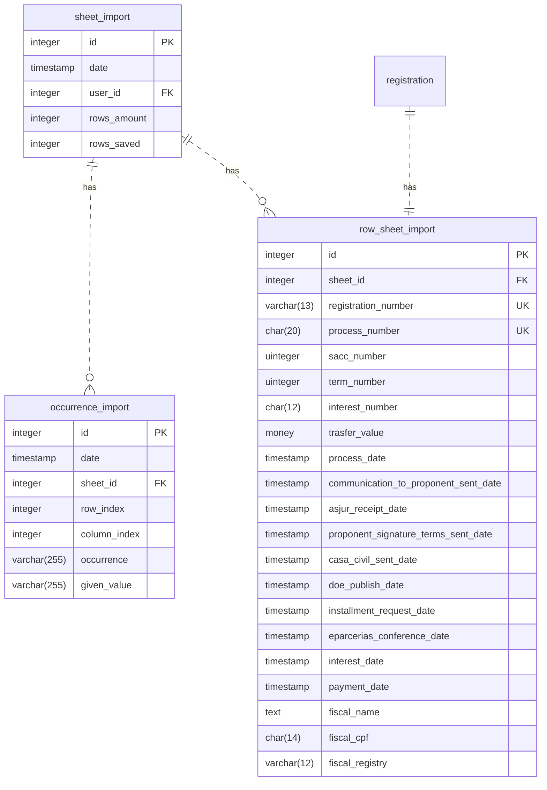

# Plugin BigSheetImporter

Plugin para importação de uma planilha específica da Secult CE.

## Alterações no Schema
### Novas tabelas

```mermaid
erDiagram
s ||..o{ o : has
s ||..o{ r : has
registration ||..|| r : has

s[sheet_import]{
    integer       id                      PK
    timestamp     date
    integer       user_id                 FK
    integer       rows_amount
    integer       rows_saved
}
o[occurrence_import]{
    integer       id                      PK
    timestamp     date
    integer       sheet_id                FK
    integer       row_index
    integer       column_index
    varchar(255)  occurrence
    varchar(255)  given_value
}
r[row_sheet_import]{
    integer       id                      PK
    integer       sheet_id                FK
    varchar(13)   registration_number     UK
    char(20)      process_number          UK
    uinteger      sacc_number
    uinteger      term_number
    char(12)      interest_number
    money         trasfer_value
    timestamp     process_date
    timestamp     communication_to_proponent_sent_date
    timestamp     asjur_receipt_date
    timestamp     proponent_signature_terms_sent_date
    timestamp     casa_civil_sent_date
    timestamp     doe_publish_date
    timestamp     installment_request_date
    timestamp     eparcerias_conference_date
    timestamp     interest_date
    timestamp     payment_date
    text          fiscal_name
    char(14)      fiscal_cpf
    varchar(12)   fiscal_registry
}
```
