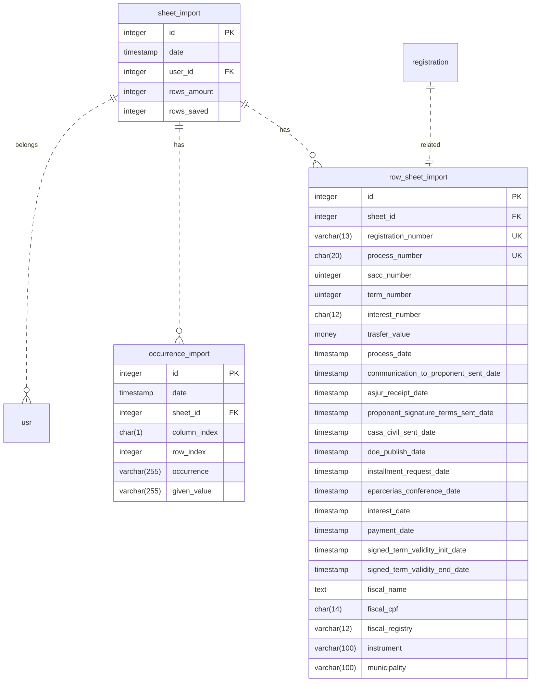

# Plugin BigSheetImporter

Plugin para importação de uma planilha específica da Secult CE.

## Alterações no Schema
### Novas tabelas


# API - DOC. DO ENDPOINT

### Sessão que documentação o endpoint existente e a finalidade

ℹ️ - Informação da responsabilidade das notificações
#### GET  infoForNotificationsAccountability
**Rota**: bigsheet/infoForNotificationsAccountability
**Retorno**: Json
**Parâmetros**: Request com HTTP_ACCESS_TOKEN

ℹ️ - Atualiza o status da notificação para não ser notificado novamente
#### POST  updateNotificationStatus
**Rota**: bigsheet/updateNotificationStatus
**Retorno**: Json
**Parâmetros**: Request com HTTP_ACCESS_TOKEN , registration_number

---

ℹ️ - Retorna inscrições que possuem diligência ativa, 
cruzando dados do módulo Diligence com o RowSheet importado
#### GET  registrationsInDiligence
**Rota**: `bigsheet/registrationsInDiligence`
**Autenticação**: JWT no header `Authorization` + header `MapasSDK-REQUEST: true`

**Parâmetros de paginação** (opcionais):

| Parâmetro | Padrão | Descrição |
|-----------|--------|-----------|
| `@limit`  | `25`   | Quantidade de itens por página |
| `@page`   | `1`    | Número da página |
| `@offset` | calculado a partir de `@page` | Deslocamento direto (sobrescreve `@page`) |

**Exemplo de requisição**:
```
GET bigsheet/registrationsInDiligence?@limit=10&@page=1
Authorization: <jwt_token>
MapasSDK-REQUEST: true
```

**Retorno**:
```json
{
  "data": [
    {
      "registration_number": "on-123",
      "diligence_situation": 3,
      "row_sheet": {
        "municipality": "Fortaleza",
        "instrument": "Termo de Fomento",
        "sacc": 456
      },
      "agent": {
        "name": "Nome do Agente",
        "cpf": "000.000.000-00"
      }
    }
  ],
  "meta": {
    "total": 47,
    "page": 1,
    "limit": 10,
    "numPages": 5
  }
}
```

**Situações de diligência retornadas**:

| Valor | Descrição |
|-------|-----------|
| `2`   | Aberta |
| `3`   | Enviada ao proponente |
| `4`   | Respondida |
| `10`  | TADO gerado |

---

ℹ️ - Retorna oportunidades com diligência ativa (metadado `use_diligence = Sim`), vinculadas a projetos com o selo de id 16, com suas respectivas inscrições e dados da planilha importada
#### GET  opportunitiesWithDiligence
**Rota**: `pc/lista`
**Autenticação**: JWT no header `Authorization` + header `MapasSDK-REQUEST: true`

**Parâmetros de paginação** (opcionais):

| Parâmetro | Padrão | Descrição |
|-----------|--------|-----------|
| `@limit`  | `25`   | Quantidade de itens por página |
| `@page`   | `1`    | Número da página |
| `@offset` | calculado a partir de `@page` | Deslocamento direto (sobrescreve `@page`) |

**Exemplo de requisição**:
```
GET pc/lista?@limit=10&@page=1
Authorization: <jwt_token>
MapasSDK-REQUEST: true
```

**Retorno**:
```json
{
  "data": [
    {
      "id": 123,
      "oportunidade_pai": "Nome do edital pai",
      "nome": "Nome da fase de inscrição",
      "projeto": "Nome do projeto",
      "nome_agent": "Nome do agente responsável pela oportunidade",
      "inscricao_id": 456,
      "inscricao_numero": "CE2025001",
      "inscricao_status": 10,
      "inscricao_agente": "Nome do agente da inscrição",
      "inscricao_agente_cpf": "000.000.000-00",
      "sacc_number": 789,
      "instrument": "Termo de Fomento",
      "municipality": "Fortaleza"
    }
  ],
  "meta": {
    "total": 47,
    "page": 1,
    "limit": 10,
    "numPages": 5
  }
}
```

> Cada linha representa uma inscrição. Uma mesma oportunidade pode aparecer em múltiplas linhas caso possua mais de uma inscrição. Campos `sacc_number`, `instrument` e `municipality` são `null` quando não há registro na planilha importada para aquela inscrição.

**Status de inscrição (`inscricao_status`)**:

| Valor | Descrição |
|-------|-----------|
| `1`   | Rascunho |
| `2`   | Enviada |
| `3`   | Inválida |
| `4`   | Não selecionada |
| `5`   | Suplente |
| `10`  | Aprovada |
